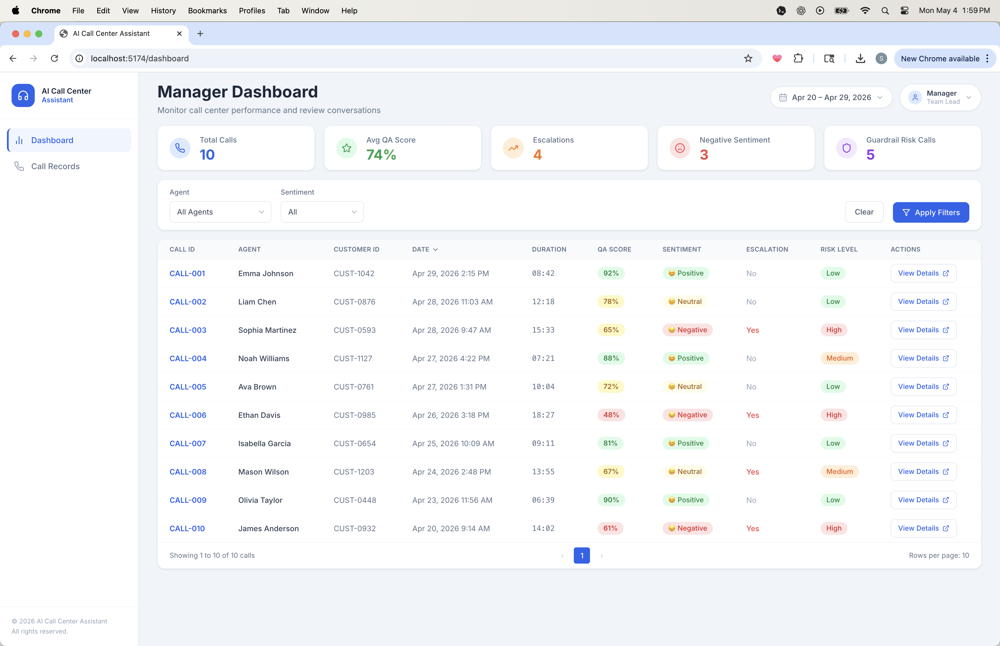
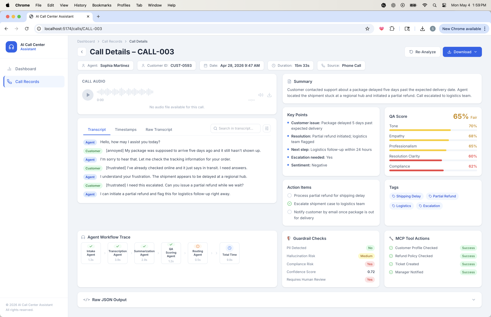

# AI Call Center Assistant

A full-stack AI-powered call center analysis platform. Converts call transcripts and audio into structured summaries, quality scores, guardrail checks, agent workflow traces, and routing decisions — served through a modern React dashboard UI backed by a FastAPI multi-agent pipeline.

---

## Features

- **Multi-agent pipeline**: Intake → Transcription → Summarization → QA Scoring → Routing — orchestrated with LangGraph
- **Manager Dashboard**: Overview of all calls with stats cards (Total Calls, Avg QA Score, Escalations, Negative Sentiment, Guardrail Risk), agent/sentiment filters, and a sortable call records table
- **Call Details page**: Per-call deep-dive with audio player, transcript viewer, QA score breakdown, key points, action items, tags, guardrail checks, MCP tool actions, and agent workflow trace
- **Re-Analyze**: Trigger live backend analysis on any call and merge results into the UI without a page reload
- **Guardrails**: PII detection, hallucination risk, compliance risk, and confidence scoring
- **Conversational assistant**: Chat endpoint with per-session sliding-window memory (last 10 turns)
- **React frontend**: Vite + Tailwind CSS SaaS dashboard — built into the Docker image at deploy time
- **FastAPI backend**: Structured REST API with LangChain/LangGraph orchestration and structured Pydantic schemas
- **Single-container deployment**: Multi-stage Dockerfile builds the React app then serves it via FastAPI's static-file mount

---

## Screenshots

### Manager Dashboard


*Overview of all calls with stats cards, agent/sentiment filters, and a sortable call records table.*

### Call Details


*Per-call deep-dive showing the audio player, transcript viewer, QA score breakdown, key points, action items, tags, guardrail checks, MCP tool actions, and the agent workflow trace.*

---

## Tech Stack

| Layer | Technology |
|---|---|
| Frontend | React 18, Vite 5, Tailwind CSS 3, React Router 6, lucide-react |
| Backend | FastAPI 0.115, LangChain 0.2, LangGraph 0.2, OpenAI SDK 1.x |
| Transcription | OpenAI Whisper (via `openai.audio.transcriptions`) |
| Containerisation | Docker (multi-stage build), Docker Compose |
| Cloud / Deploy | Hugging Face Spaces (Docker SDK), AWS ECS (configs in `infra/`) |
| Testing | Pytest, pytest-asyncio |

---

## Project Structure

```text
Call_Center/
├── app/
│   ├── agents/call_center/    # Multi-agent pipeline
│   │   ├── agent.py           # Orchestrator + LangGraph graph + chat handler
│   │   ├── intake_agent.py
│   │   ├── transcription_agent.py
│   │   ├── summarization_agent.py
│   │   ├── quality_score_agent.py
│   │   ├── routing_agent.py
│   │   ├── guardrails.py      # PII / hallucination / compliance checks
│   │   ├── schemas.py         # Pydantic request/response models
│   │   └── prompts.py
│   ├── api/routes/
│   │   └── call_center.py     # FastAPI route handlers
│   ├── core/
│   │   ├── config.py          # Pydantic-Settings config
│   │   └── logging.py
│   └── services/
│       └── mcp_tools.py       # MCP tool runner
├── frontend/                  # React + Vite SaaS dashboard
│   ├── src/
│   │   ├── pages/
│   │   │   ├── ManagerDashboard.jsx
│   │   │   └── CallDetails.jsx
│   │   ├── components/
│   │   │   ├── Sidebar.jsx
│   │   │   ├── AudioPlayer.jsx
│   │   │   ├── NewCallModal.jsx
│   │   │   ├── StatsCard.jsx
│   │   │   └── Table.jsx
│   │   ├── data/
│   │   │   ├── mockData.js    # 10 sample call records
│   │   │   └── callStore.js
│   │   ├── api/callCenter.js  # Fetch wrappers for backend API
│   │   └── hooks/useApi.js    # Async state hook
│   └── package.json
├── tests/
│   ├── test_agents/           # Pipeline + guardrail unit tests
│   └── test_api/              # API integration tests
├── infra/                     # AWS ECS task/service definitions + IAM policies
├── Samples_Con/               # Sample transcripts for manual testing
├── Dockerfile                 # Multi-stage build (Node → Python)
├── docker-compose.yml
├── requirements.txt
└── pytest.ini
```

---

## Quick Start

### Prerequisites

- Python 3.11+
- Node.js 20+
- An `OPENAI_API_KEY`

### Local development (separate processes)

**Backend**

```bash
cp .env.example .env          # then add your OPENAI_API_KEY
python -m venv .venv && source .venv/bin/activate
pip install -r requirements.txt
uvicorn app.main:app --reload --port 8000
# API → http://localhost:8000
# Docs → http://localhost:8000/docs
```

**Frontend**

```bash
cd frontend
npm install
npm run dev
# UI → http://localhost:5173
```

> The Vite dev server proxies all `/api/*` requests to `http://localhost:8000`, so no CORS configuration is needed during development.

### Docker (full stack, single container)

```bash
cp .env.example .env          # add your OPENAI_API_KEY
docker-compose up --build
# App → http://localhost:7860
```

The multi-stage `Dockerfile` builds the React frontend with Node 20, then packages everything into a Python 3.11-slim runtime image. FastAPI serves the compiled React SPA from `/frontend/dist` and exposes the REST API under `/api/v1/`.

---

## API Endpoints

| Method | Path | Description |
|--------|------|-------------|
| `POST` | `/api/v1/call-center/analyze` | Full multi-agent analysis from transcript text |
| `POST` | `/api/v1/call-center/analyze/upload` | Full analysis from an uploaded audio file (Whisper transcription) |
| `POST` | `/api/v1/call-center/chat` | Conversational assistant with per-session memory |
| `DELETE` | `/api/v1/call-center/session/{session_id}` | Clear a chat session's conversation history |
| `GET` | `/health` | Health check — returns `{"status": "healthy"}` |

Interactive API docs are available at `/docs` (Swagger UI) and `/redoc`.

---

## Environment Variables

| Variable | Required | Description |
|---|---|---|
| `OPENAI_API_KEY` | Yes | OpenAI API key used for LLM inference and Whisper transcription |
| `APP_ENV` | No | `development` (default) or `production` |
| `LOG_LEVEL` | No | `INFO` (default) |

---

## Running Tests

```bash
source .venv/bin/activate
pytest
```

Test coverage includes the full agent pipeline, guardrails logic, and API endpoints (see `tests/`).

---

## Deploying to Hugging Face Spaces

This repo is pre-configured for [Hugging Face Spaces](https://huggingface.co/spaces) with the `docker` SDK. The Space frontmatter at the top of this file sets `app_port: 7860`, which matches the port exposed in `docker-compose.yml` and the Dockerfile.

### Steps

1. Create a new Space on Hugging Face (Docker SDK, public or private).
2. Add your `OPENAI_API_KEY` as a **Repository Secret** in the Space settings (`Settings → Repository secrets`).
3. Push this repository to the Space's Git remote:

```bash
# First time — add the Space as a remote
git remote add space https://huggingface.co/spaces/<your-username>/<your-space-name>

# Push
git push space main
```

Hugging Face will automatically build the Docker image and launch the app. No changes to the code are required.

---

## Deploying to AWS ECS

Infrastructure definitions are in `infra/`:

- `infra/ecs/task-definition.json` — ECS task definition
- `infra/iam/` — execution and task IAM role policies
- `infra/deploy.sh` — deployment helper script

See `infra/ecs/service-definition.md` for step-by-step ECS deployment instructions.

---

## Notes

- Mock data (10 sample call records) is used for the dashboard and call list on first load. Live analysis is triggered per-call via the **Re-Analyze** button, which calls the backend and merges results into the UI state.
- The conversational chat endpoint maintains a sliding window of the last 10 turns per session. Sessions are stored in memory and can be cleared via the `DELETE` endpoint.
